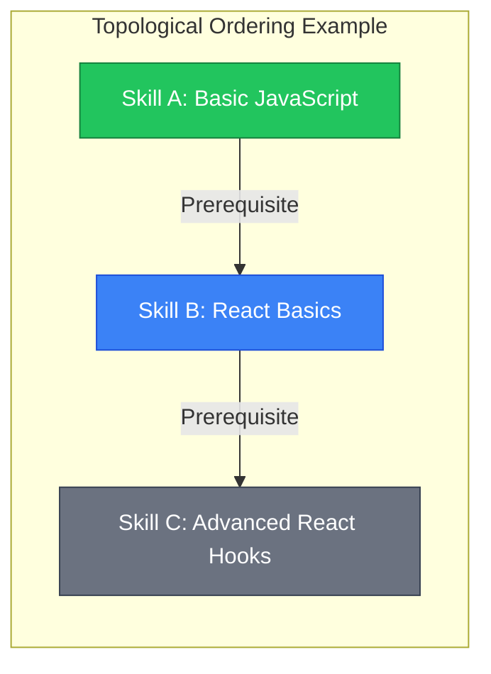

# Skill Map: Career Path & Skill Gap Analysis Platform
## Project Documentation

Welcome to the comprehensive documentation for **Skill Map** (also referred to as *Skill DNA*). This platform is an enterprise-grade Career Path and Skill Gap Analysis system designed to map job competencies, assess individual performance through dynamic evaluations, run sandboxed coding challenges, and chart a personalized path to job readiness.

---

## Table of Contents
1. [Why I Have Chosen This Project (Motivation)](#1-why-i-have-chosen-this-project-motivation)
2. [Project Objective](#2-project-objective)
3. [Technology Stack & Architectural Rationale](#3-technology-stack--architectural-rationale)
4. [Core Features](#4-core-features)
5. [Platform Workflows](#5-platform-workflows)
   - [User Journey Workflow](#user-journey-workflow)
   - [Skill Dependency Workflow (Topological Sort)](#skill-dependency-workflow-topological-sort)
6. [Database Architecture & Models](#6-database-architecture--models)
7. [API Route Mapping](#7-api-route-mapping)
8. [Frontend Pages & Components Structure](#8-frontend-pages--components-structure)
9. [Setup & Running Guide](#9-setup--running-guide)
10. [Analytics Dashboard](#10-analytics-dashboard)
11. [Bulk CSV Import](#11-bulk-csv-import)
12. [Role-Based Access Control (RBAC)](#12-role-based-access-control-rbac)
13. [Problems Faced & Resolutions](#13-problems-faced--resolutions)
14. [Outcomes Gained](#14-outcomes-gained)
15. [Future Scope](#15-future-scope)

---

## 1. Why I Have Chosen This Project (Motivation)

In the modern technology landscape, the gap between academic preparation and industry readiness is wider than ever. Learners face several key challenges:
*   **Non-Linear Career Roadmaps**: Traditional curriculum designs are static and linear, ignoring the complex, network-like dependencies of modern tech skills (e.g., understanding React requires JavaScript, which requires HTML/CSS).
*   **Theoretical Assessments**: Standard tests verify static knowledge but fail to check practical programming ability.
*   **Lack of Actionable Analytics**: Individuals do not have visibility into how their current skills stack up against industry demands and job expectations.

**Skill Map** was chosen to solve these exact issues. By building a graph-based representation of skill relationships and providing sandboxed, hands-on code evaluations, the platform transforms static career paths into dynamic, personalized journeys that bridge theory and practice.

---

## 2. Project Objective

The primary objective of the platform is to empower both learners and administrators through:
1.  **Automated Pathfinding**: Dynamically sequence skill modules using a topological sort based on prerequisite constraints.
2.  **Hands-On Validation**: Verify programming skills via a sandboxed execution environment (running Python, JavaScript, and Java) with hidden verification tests.
3.  **Data-Driven Analytics**: Track skill levels against job benchmarks (like Industry Demand and Importance Scores) using rich dashboards.
4.  **Generative AI Workflows**: Integrate LLM capability to generate high-quality assessment questions, verify edge cases, and tutor learners in real-time.
5.  **Granular Security**: Provide a strict Role-Based Access Control (RBAC) permissions matrix to segregate administrative, editorial, and student actions.

---

## 3. Technology Stack & Architectural Rationale

The project splits clean architectural boundaries between the backend API service and the frontend Single Page Application (SPA):

### Backend API
*   **Runtime Environment**: Node.js – chosen for asynchronous I/O performance and rich ecosystem.
*   **Web Framework**: Express.js – lightweight and flexible route handling with middleware support.
*   **Database**: MongoDB via Mongoose ODM – flexible, document-oriented schema design perfectly suited for complex, nested data like roadmap graphs, dynamic test cases, and custom user logs.
*   **Authentication**: Passport.js (Google OAuth 2.0 Integration) & JWT – provides safe social sign-in and token-based API authentication.
*   **Code Runner Sandbox**: Piston API integration – enables running user-submitted code (JavaScript, Python, Java) inside safe, remote dockerized environments.
*   **AI Integration**: OpenAI client mapping to Hugging Face Router (`deepseek-ai/DeepSeek-V3.2:novita` model) – generates context-aware coding, fill-in-the-blank, and MCQ questions.

### Frontend SPA
*   **Core Libraries**: React (Vite environment) – delivers rapid UI state updates and lightning-fast loading speeds.
*   **Styling**: Tailwind CSS & Vanilla CSS – custom components styled with rich transitions, modern typography, and a dark/light mode toggle.
*   **Animations**: Framer Motion – drives premium transitions, layout shifting, and responsive micro-animations.
*   **State & Theme Management**: React Context API (`ThemeContext` and `PermissionContext`) – manages active configurations and RBAC state client-wide.

---

## 4. Core Features

### 1. Dual-Role Authentication Suite
*   **Credential Engine**: Custom password storage salted and hashed using `bcryptjs`.
*   **Social Sign-In**: Google OAuth with role parameters passed via state variables to prevent administrative escalation.
*   **Token Delivery**: JWT tokens signed with a 1-day expiration, secure API authorization.
*   **Password Recovery**: Reset tokens sent via email with expiration checks.

### 2. Job Roles & Skill Mapping
*   **Job Role Publisher**: Admins can draft and edit job roles with descriptions and version tracking. Once finalized, they are published for user enrollment.
*   **Prerequisite Bindings**: Skills can have multiple prerequisites.
*   **Circular Dependency Blocker**: Uses a Depth-First Search (DFS) cycle-detection algorithm to ensure circular prerequisites are blocked on configuration.

### 3. Dynamic Assessments
*   **Level Progression**: A single skill has multiple progressive levels (e.g., Level 1: Beginner, Level 2: Intermediate).
*   **Assessment Rules**: Configurable minimum passing percentages, timers, and attempt limits per level.
*   **Randomized Pools**: Pulls a subset of active questions (`randomPick`) using MongoDB's `$sample` aggregation framework to ensure variations on re-attempts.

### 4. Interactive Coding Environment
*   **Code Runner Sandbox**: Fully supports running Python, JavaScript, and Java.
*   **Test Case Engine**: Evaluates user code against multiple test cases. Supports marking test cases as `isHidden` (evaluated on the backend to prevent cheating).
*   **Piston Execution**: Normalizes whitespaces, captures stdout/stderr, and returns compilation details.

### 5. Personalized Roadmap Builder
*   **Topological Sorting Engine**: Enrolls users into a Job Role and sequences skills topologically based on their prerequisites.
*   **Visual States**: Node states reflect progression: `locked` (prerequisites missing), `in-progress` (available), and `completed` (all levels passed).
*   **Dependency Propagation**: Completing a skill triggers a cascade that automatically unlocks downstream nodes in the roadmap.

### 6. AI Question Generator & Assistant Widget
*   **Automated Question Builder**: Admins generate questions on the fly by specifying Job Role, Skill, Difficulty, and Type.
*   **AI Engine**: Hits Hugging Face's router using `DeepSeek-V3.2` to parse schema-compliant question structures.
*   **AI Chat Widget**: Logged-in users can converse with an AI assistant via a sidebar to clear conceptual blockers.

---

## 5. Platform Workflows

### User Journey Workflow
Below is the workflow showing how users sign up, select job roles, navigate roadmaps, and pass assessments to unlock subsequent career steps:

```mermaid
graph TD
    subgraph Admin Tasks
        A[Admin Register/Login] --> B[Manage Job Roles]
        B --> C[Manage Skills within Job Roles]
        C --> D[Configure Prerequisites for Skills]
        D --> E[Manage Assessment Levels 1, 2, 3...]
        E --> F[Manage Question Bank MCQ/Fill-Blank/Coding]
        F -->|Optional AI Generation| G[DeepSeek Question Generator via HF]
    end

    subgraph User Journey
        H[User Register/Login] --> I[Select Target Job Role]
        I --> J[Generate Topological Learning Roadmap]
        J --> K[Start Active Skill]
        K --> L[Attempt Timed Assessment Level]
        L -->|Multiple Choice / Fill Blank| M[Submit Answers]
        L -->|Coding Question| N[Write & Execute Code]
        N -->|Piston Runner API| O[Validate Public/Hidden Test Cases]
        O --> M
        M --> P{Passed minPassingPercentage?}
        P -->|No| Q[Increment Attempt & Try Again if Attempts Left]
        P -->|Yes| R[Unlock Next Assessment Level]
        R --> S{All Levels for Skill Passed?}
        S -->|Yes| T[Update Skill Status to Completed]
        T --> U[Unlock Next Skill in Roadmap]
        S -->|No| L
    end
```



### Skill Dependency Workflow (Topological Sort)
Prerequisites determine the order of the roadmap. The platform uses a topological sort to make sure skills are learned in the correct sequence. 



---

## 6. Database Architecture & Models

The database structure relies on relational references within MongoDB collections, optimized with custom indexes for high-speed query execution.

### 1. User ([User.js](file:///c:/Users/redhu/OneDrive/Dokumen/SkillGapAnalysis/backend/models/User.js))
Tracks user credentials, settings, target career path, and currently active skill.
```javascript
{
  name: { type: String, required: true },
  email: { type: String, required: true, unique: true },
  password: { type: String, required: true },
  role: { type: String, default: "user" },
  resetPasswordToken: String,
  resetPasswordExpires: Date,
  theme: { type: String, enum: ["light", "dark"], default: "light" },
  jobRole: { type: ObjectId, ref: "JobRole", default: null },
  currentSkill: { type: ObjectId, ref: "Skill", default: null },
  skillStatus: { type: String, enum: ["not_started", "in_progress", "weak", "completed"], default: "not_started" }
}
```

### 2. Admin ([Admin.js](file:///c:/Users/redhu/OneDrive/Dokumen/SkillGapAnalysis/backend/models/Admin.js))
Tracks administrative accounts with editing rights over job roles and questions.
```javascript
{
  name: { type: String, required: true },
  email: { type: String, required: true, unique: true },
  password: { type: String, required: true },
  role: { type: String, default: "admin" }
}
```

### 3. JobRole ([JobRole.js](file:///c:/Users/redhu/OneDrive/Dokumen/SkillGapAnalysis/backend/models/JobRole.js))
Defines target roles mapped to set of competencies.
```javascript
{
  name: { type: String, required: true, trim: true },
  description: { type: String, required: true },
  status: { type: String, enum: ["draft", "published"], default: "draft" },
  version: { type: Number, default: 1 },
  createdBy: { type: ObjectId, ref: "Admin", required: true }
}
```

### 4. Skill ([Skill.js](file:///c:/Users/redhu/OneDrive/Dokumen/SkillGapAnalysis/backend/models/Skill.js))
Skills categorized under job roles, linked through prerequisite mappings.
```javascript
{
  name: { type: String, required: true, trim: true },
  category: { type: String, required: true, trim: true },
  jobRole: { type: ObjectId, ref: "JobRole", required: true },
  status: { type: String, enum: ["active", "inactive"], default: "active" },
  createdBy: { type: ObjectId, ref: "Admin", required: true },
  prerequisites: [{ type: ObjectId, ref: "Skill" }]
}
```

### 5. Question ([Question.js](file:///c:/Users/redhu/OneDrive/Dokumen/SkillGapAnalysis/backend/models/Question.js))
Questions belonging to a skill or assessment. Supports MCQs, fill-blanks, and coding sandboxes.
```javascript
{
  skill: { type: ObjectId, ref: "Skill", required: function() { return !this.assessment; } },
  assessment: { type: ObjectId, ref: "Assessment", default: null },
  type: { type: String, enum: ["mcq", "coding", "fill-blank"], required: true },
  difficulty: { type: String, enum: ["easy", "medium", "hard"], default: "medium" },
  questionText: { type: String, required: true },
  options: [String],
  correctAnswer: { type: Schema.Types.Mixed, required: function() { return this.type !== "coding"; } },
  language: String,
  testCases: [{
    input: { type: String, required: true },
    expectedOutput: { type: String, required: true },
    isHidden: { type: Boolean, default: false }
  }],
  timer: { type: Number, default: 0 },
  createdBy: { type: ObjectId, ref: "Admin", required: true },
  status: { type: String, enum: ["active", "inactive"], default: "active" }
}
```

### 6. Assessment ([Assessment.js](file:///c:/Users/redhu/OneDrive/Dokumen/SkillGapAnalysis/backend/models/Assessment.js))
Tracks levels belonging to a skill. Runs sample aggregation queries.
```javascript
{
  skill: { type: ObjectId, ref: "Skill", required: true },
  name: { type: String, required: true },
  level: { type: Number, required: true },
  questions: [{ type: ObjectId, ref: "Question" }],
  totalQuestions: { type: Number, required: true },
  randomPick: { type: Number, required: true },
  timer: { type: Number, required: true },
  minPassingPercentage: { type: Number, required: true },
  maxAttempts: { type: Number, required: true },
  createdBy: { type: ObjectId, ref: "Admin", required: true },
  status: { type: String, enum: ["draft", "published", "inactive"], default: "draft" }
}
```

### 7. UserSkill ([UserSkill.js](file:///c:/Users/redhu/OneDrive/Dokumen/SkillGapAnalysis/backend/models/UserSkill.js))
Core progress tracking mapped per user.
```javascript
{
  user: { type: ObjectId, ref: "User", required: true },
  jobRole: { type: ObjectId, ref: "JobRole", required: true },
  skill: { type: ObjectId, ref: "Skill", required: true },
  status: { type: String, enum: ["locked", "in-progress", "completed"], default: "locked" },
  currentAssessmentLevel: { type: Number, default: 1 },
  completedAssessmentLevels: [{ type: Number }],
  attemptsByLevel: { type: Map, of: Number, default: {} },
  lastAttemptAt: Date
}
```

### 8. ReadinessConfig ([ReadinessConfig.js](file:///c:/Users/redhu/OneDrive/Dokumen/SkillGapAnalysis/backend/models/ReadinessConfig.js))
Dynamic formulas configuration for skill gap severity levels, industry benchmarks, and triggers.

---

## 7. API Route Mapping

All endpoints require JWT payloads (`protect` middleware) and role validations (`verifyRole`/`verifyRoles` middleware).

### Auth Module (`/auth`)
*   `GET /auth/google` - Initiates the Google OAuth flow.
*   `GET /auth/google/callback` - Callback landing page.
*   `POST /auth/forgot-password` - Requests reset email.
*   `POST /auth/reset-password/:token` - Submits new credentials.

### User Module (`/api/user` & `/api/user/me`)
*   `POST /api/user/register` - Creates user.
*   `POST /api/user/login` - Signs in user, returns JWT.
*   `GET /api/user/me` - Resolves logged-in profile.
*   `GET /api/user/stats` - Pulls career completion metrics.
*   `GET /api/user/roadmap/:jobRoleId` - Returns topologically sorted skill list.

### Admin Profile Module (`/api/admin`)
*   `POST /api/admin/register` - Creates admin account.
*   `POST /api/admin/login` - Authenticates admin, returns JWT.
*   `GET /api/admin/dashboard-stats` - Pulls overall platform stats.

### Job Roles Module (`/api/job-roles`)
*   `GET /api/job-roles/published` - Returns published catalog.
*   `GET /api/job-roles/all` - Returns draft and published catalog (admin view).
*   `POST /api/job-roles/create` - Creates new role (admin).
*   `PUT /api/job-roles/update/:id` - Edits role config (admin).

### Skills Module (`/api/skills` - routed via [skillRoutes.js](file:///c:/Users/redhu/OneDrive/Dokumen/SkillGapAnalysis/backend/routes/skillRoutes.js))
*   `POST /api/skills/create` - Creates skill (admin).
*   `PUT /api/skills/update/:skillId` - Edits skill details (admin).
*   `PUT /api/skills/prerequisites/:skillId` - Binds prerequisites (admin, circular dependency checked).
*   `GET /api/skills/:skillId/details` - Fetches lock state and details (user).
*   `POST /api/skills/job-role/:jobRoleId/start-learning` - Initializes learning path (user).

### Assessments Module (`/api/assessments`)
*   `GET /api/assessments/attempts/:assessmentId` - Fetches attempt logs (user).
*   `GET /api/assessments/questions/:assessmentId` - Fetches random question pool without answers (user).
*   `POST /api/assessments/submit/:assessmentId` - Compiles answers and updates stats (user).

### AI & Code execution (`/api/ai` & `/api/code`)
*   `POST /api/code/run` - Runs code tests inside Piston sandbox ([codeExecutionController.js](file:///c:/Users/redhu/OneDrive/Dokumen/SkillGapAnalysis/backend/controllers/codeExecutionController.js)).
*   `POST /api/ai/generate` - Automatically drafts questions via DeepSeek (admin).
*   `POST /api/ai/chat` - Chats with learning tutor widget.

---

## 8. Frontend Pages & Components Structure

```
frontend/src/
├── api/
│   └── axiosInstance.js        # Configures Axios HTTP calls with JWT Authorization headers
├── components/
│   ├── ai/
│   │   └── AIChatWidget.jsx    # Pop-up conversational widget for continuous assistance
│   ├── assessment/
│   │   └── QuestionForm.jsx    # Component layout rendering MCQ and coding questions
│   ├── Navbar.jsx              # Main platform header navbar controls
│   ├── AdminHeader.jsx         # Layout header header for admin views
│   └── AdminSidebar.jsx        # Navigation controller for backend configurations
├── context/
│   └── ThemeContext.jsx        # Light/Dark mode state management provider
├── layouts/
│   └── AdminLayout.jsx         # Flex sidebar layout wrapping all admin panels
├── pages/
│   ├── Landing.jsx             # Public promotional page outlining product features
│   ├── Login.jsx               # Single sign-on and credential sign-in gate page
│   ├── ForgotPassword.jsx      # Password request retrieval form page
│   ├── ResetPassword.jsx       # Reset password token confirmation page
│   ├── OAuthSuccess.jsx        # Catch-page capturing JWT token parameters from Google callback
│   ├── admin/
│   │   ├── Dashboard.jsx       # Overview of statistics and charts (admin view)
│   │   ├── JobRoles.jsx        # Create, edit, and publish career roles (admin view)
│   │   ├── Skills.jsx          # Skills categorizer and prerequisite selector (admin view)
│   │   ├── Questions.jsx       # Assessment creator with AI DeepSeek Generator integrations (admin view)
│   │   └── Profile.jsx         # Profile configurations (admin view)
│   └── user/
│       ├── UserDashboard.jsx   # Enrolled path status and overall roadmap overview (user view)
│       ├── JobRoles.jsx        # Selection and enrollment catalog for roles (user view)
│       ├── Roadmap.jsx         # Visual learning roadmap showcasing unlock progression (user view)
│       ├── SkillsPage.jsx      # Assessment dashboard for starting exams (user view)
│       └── AssessmentPage.jsx  # Active assessment screen with code editor and timer (user view)
├── routes/
│   ├── AppRoutes.jsx           # Core route mapping configuration
│   └── AdminRoutes.jsx         # Nested sub-routes for admin actions inside AdminLayout
├── App.jsx                     # Top-level React routing selector
└── main.jsx                    # System entry mounting index.html
```

---

## 9. Setup & Running Guide

Ensure Node.js (v18+) and MongoDB are running.

### 1. Backend Setup
1.  Navigate to `backend/`.
2.  Configure `.env`:
    ```env
    PORT=5000
    MONGO_URI=mongodb://127.0.0.1:27017/skillgap
    JWT_SECRET=your_jwt_signing_secret
    HF_TOKEN=your_hugging_face_api_token
    GOOGLE_CLIENT_ID=your_google_oauth_client_id
    GOOGLE_CLIENT_SECRET=your_google_oauth_client_secret
    GOOGLE_CALLBACK_URL=http://localhost:5000/auth/google/callback
    ```
3.  Run `npm install` followed by `npm run dev`.

### 2. Frontend Setup
1.  Navigate to `frontend/`.
2.  Run `npm install` followed by `npm run dev`.
3.  Access the interface at `http://localhost:5173`.

---

## 10. Analytics Dashboard

An interactive dashboard available at `/admin/analytics` tracking:
*   **Industry Demand Score**: Aggregated average, minimum, and maximum scores.
*   **Importance Score**: Multi-role weight comparisons.

Both modules are configured using Recharts:
*   **BarChart**: Visualizes competency weights with interactive gradient hover overlays.
*   **LineChart**: Plots dynamic historical trends.
*   **CSV Export**: Simple download links generate raw tabular reports for administrative tracking.

---

## 11. Bulk CSV Import

Speeds up database seeding for skill linkages. Accessible via the **CSV Import Modal** in admin sections.

### Schema Blueprint
```csv
fromSkillId,toSkillId,relationship,dependencyType
65a25f9d273a216db8a101d2,65a25f9d273a216db8a101d3,prerequisite,Required
65a25f9d273a216db8a101d4,65a25f9d273a216db8a101d5,related,Optional
```
*   **relationships**: `parent` | `child` | `prerequisite` | `related`
*   **dependencyTypes**: `Required` | `Recommended` | `Optional`

### Ingestion Protocol
1.  **Stream Processing**: Parsed incrementally via `csv-parse` to prevent memory bottlenecks.
2.  **Referential Checks**: Resolves ID formats and ensures referenced records exist in the database.
3.  **Bulk Write Operations**: Uses `SkillRelation.insertMany(..., { ordered: false })` to ignore duplicates and process correct items.
4.  **UI Feedback Panel**: Displays counts of processed, inserted, and skipped elements with exact row errors.

---

## 12. Role-Based Access Control (RBAC)

The platform enforces a granular authorization structure across front-end views and back-end API routes:

| Role | Actions Allowed | Constraints |
| :--- | :--- | :--- |
| **admin** | Full management, Role creation, AI generation, CSV Imports. | No restrictions. |
| **manager** | Views dashboards, edits skills, configures prerequisites. | Cannot create new Job Roles or perform CSV imports. |
| **contributor**| Creates and edits assessment questions. | Cannot change Job Roles or Skill prerequisites. |
| **viewer** | Views personal roadmap, dashboards, and analytical cards. | Read-only. (Alias: `user`) |

*   **Backend Validation**: Gated via the `verifyRoles([...])` helper middleware within routing controllers.
*   **Frontend Validation**: Handled by [PermissionContext.jsx](file:///c:/Users/redhu/OneDrive/Dokumen/SkillGapAnalysis/frontend/src/context/ThemeContext.jsx) exposing a `hasPermission()` validation hook to dynamically toggle UI action items.

---

## 13. Problems Faced & Resolutions

During development, the team encountered several technical obstacles:

### 1. Circular Prerequisite Dependencies in Graph Structures
*   **Problem**: Because admins can customize prerequisites, they could configure infinite loops (e.g. Skill A requires Skill B, and B requires A). This crashed the topological roadmap generator.
*   **Resolution**: Implemented a Depth-First Search (DFS) cycle-detection utility (`hasCircularDependency`) inside [skillController.js](file:///c:/Users/redhu/OneDrive/Dokumen/SkillGapAnalysis/backend/controllers/skillController.js#L7-L35). When an admin requests a prerequisite binding, the controller executes a recursion. If a cycle is detected, the request is rejected with a `400 Bad Request` code before updating MongoDB.

### 2. Schema Refactoring & Legacy Data Migrations
*   **Problem**: Upgrading the engine to track granular skill intelligence metrics (Demand, Importance scores) required restructuring database documents. Older databases lacked these parameters and stored prerequisites in simple local arrays, rendering graph traversals inefficient.
*   **Resolution**: Wrote a database migration script [addSkillIntelligenceFields.js](file:///c:/Users/redhu/OneDrive/Dokumen/SkillGapAnalysis/backend/migrations/addSkillIntelligenceFields.js). The script safely loops through skills, populates default weights, extracts historical array elements, and automatically registers them as edges in the new [SkillRelation.js](file:///c:/Users/redhu/OneDrive/Dokumen/SkillGapAnalysis/backend/models/SkillRelation.js) database model without causing service downtime.

### 3. Secure Code Execution Gating & Cheating Prevention
*   **Problem**: Letting users run custom JavaScript, Python, or Java scripts is dangerous if executed on core servers. Furthermore, if verification tests are fully exposed to the client side, users can write simple conditional prints to bypass them.
*   **Resolution**: Isolated code runs behind the Piston execution api in [codeExecutionController.js](file:///c:/Users/redhu/OneDrive/Dokumen/SkillGapAnalysis/backend/controllers/codeExecutionController.js#L261-L452). The API routes execution to a containerized sandbox. The platform splits test cases into `public` and `hidden` properties: only public outcomes are sent to the user interface, while hidden checks run exclusively on the server to verify the logic.

### 4. RBAC Transition and Backward Compatibility
*   **Problem**: The database initially labeled all students with a simple `user` string. Introducing a multi-tiered permission model (`viewer`, `manager`, `contributor`, `admin`) created authentication errors during API checks.
*   **Resolution**: Centralized the permission rules inside [permissions.js](file:///c:/Users/redhu/OneDrive/Dokumen/SkillGapAnalysis/backend/utils/permissions.js). The validation method `isAuthorized` normalizes legacy string keys dynamically (mapping `user` directly to `viewer` rights). In the Express middlewares, `verifyRoles` checks both original and normalized roles, ensuring zero breaking impacts.

---

## 14. Outcomes Gained

By implementing this platform, several key capabilities were established:
*   **Interactive Learning Roads**: Created a visual DAG (Directed Acyclic Graph) showing unlocking steps.
*   **Secure Coding Playground**: Built an editor that executes code safely in three languages.
*   **Automated Question Pipelines**: Drastically reduced administration overhead by using AI-drafted questions.
*   **Detailed Analytics Panels**: Provided clear, actionable charts showing learners their skill gaps.

---

## 15. Future Scope

The project database structures have been laid out to support several next-phase integrations:
1.  **AI Recommendation Approval Queue**: Using the [AIRecommendation.js](file:///c:/Users/redhu/OneDrive/Dokumen/SkillGapAnalysis/backend/models/AIRecommendation.js) model, build an administrative queue interface. Generated updates (forecasts, skill weightage shifts, role demands) will be queued for review, editing, and publishing.
2.  **Semantic Resume Matching**: Parse user resumes using configurations in [ResumeParserConfig.js](file:///c:/Users/redhu/OneDrive/Dokumen/SkillGapAnalysis/backend/models/ResumeParserConfig.js) and [ResumeKeywordMapping.js](file:///c:/Users/redhu/OneDrive/Dokumen/SkillGapAnalysis/backend/models/ResumeKeywordMapping.js) to auto-detect existing skills and enroll users with pre-filled completions.
3.  **Project & Course Mapping**: Direct linking of learning modules ([LearningResource.js](file:///c:/Users/redhu/OneDrive/Dokumen/SkillGapAnalysis/backend/models/LearningResource.js)) and hands-on projects ([ProjectMapping.js](file:///c:/Users/redhu/OneDrive/Dokumen/SkillGapAnalysis/backend/models/ProjectMapping.js)) to weak skills, giving learners a direct way to bridge their gaps.
